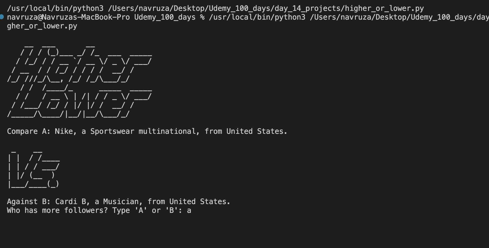

# Higher or Lower – Python Game

A fun and addictive terminal game where you guess who has more followers on social media! Inspired by the classic "Higher or Lower" game format.

---

## How It Works

- Two public figures are compared.
- Each round, you guess which one has **more followers**.
- If you're correct, your score increases and the game continues.
- If you're wrong, the game ends and your final score is shown.

---

## Screenshot

