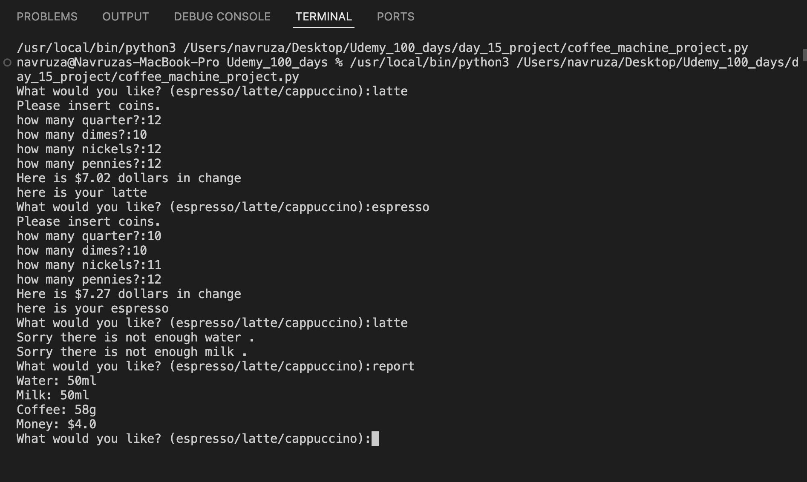

## ☕ Coffee Machine Project

This is a mini coffee machine project  written in Python. The program allows a user to purchase drinks (espresso, latte, or cappuccino), checks if the machine has enough resources to make the drink, processes coins, and provides change if necessary.

---

## 🚀 Features

- Choose between `espresso`, `latte`, or `cappuccino`
- Insert coins to pay for drinks
- Automatically checks resources (water, milk, coffee)
- Provides a report of remaining resources and earnings
- Option to shut off the machine (`off` command)

---

## Screenshot 

