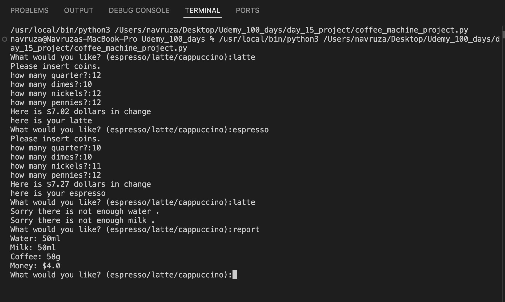

##  OOP Coffee Machine (Python)

This is an object-oriented coffee machine program written in Python. It uses classes to handle the menu, coffee maker logic, and money transactions in a clean and modular way.

---

##  Project Structure

Your project should include the following files:

- coffee_machine.py  <- Your main script
- menu.py  <- Contains Menu and MenuItem classes
- coffee_maker.py  <- Contains CoffeeMaker class
- money_machine.py  <- Contains MoneyMachine class

---

## Screenshot

