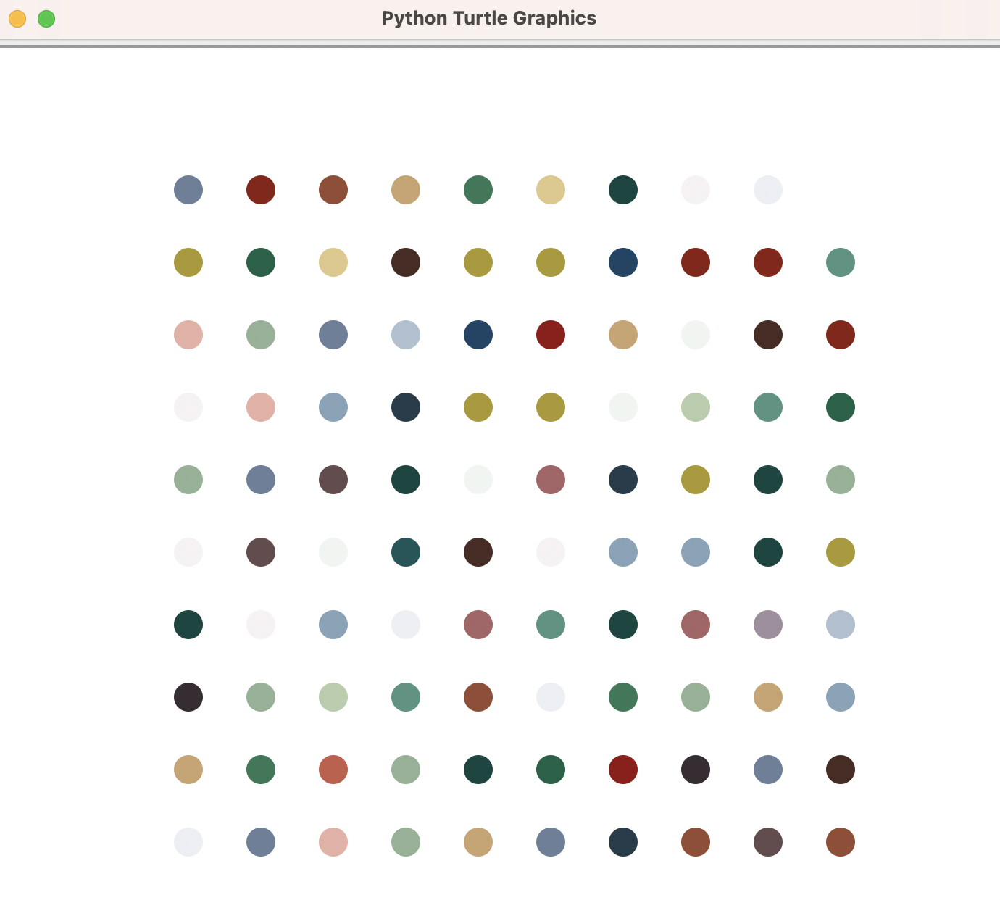

## Dot Painting with Turtle (Hirst Style)

This Python project uses the `turtle` module to create a grid of colorful dots, inspired by artist Damien Hirst’s dot paintings. Each dot is randomly selected from a predefined color palette.

---

##  Preview

> Here's a sample output showing a colorful grid of randomly colored dots:

  

