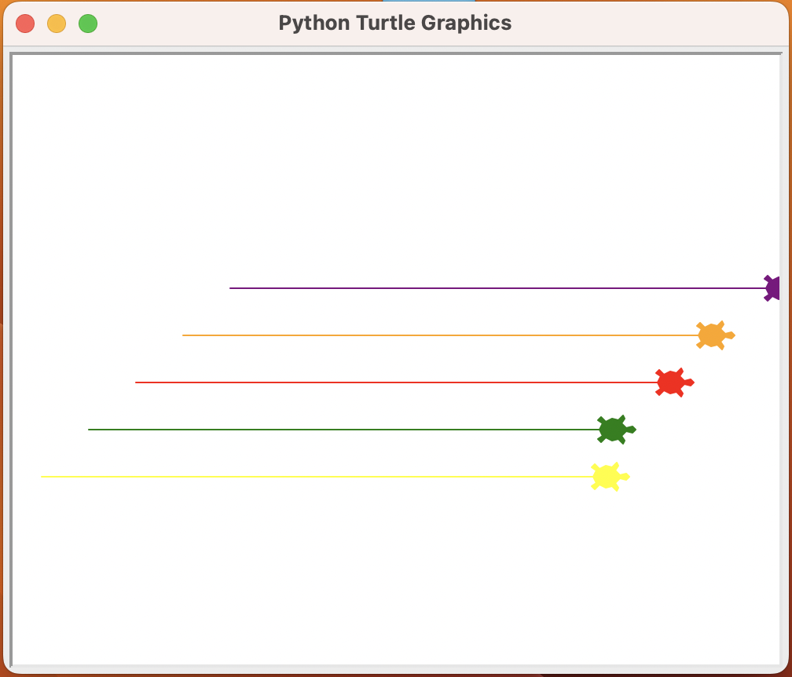

## Turtle Race Game (Python Turtle Graphics)

This is a fun and interactive turtle racing game built using Python’s `turtle` graphics module. The player bets on a turtle by color, and then the race begins—each turtle moves forward randomly until one crosses the finish line!

---

##  How to Play

1. When the game starts, you'll be prompted to enter a bet:
   - Choose a color: `yellow`, `green`, `red`, `orange`, or `purple`
2. Click **OK**, and the race begins!
3. Turtles move randomly until one crosses the finish line.
4. The game announces whether you won or lost based on your bet.

---

## Screenshot

