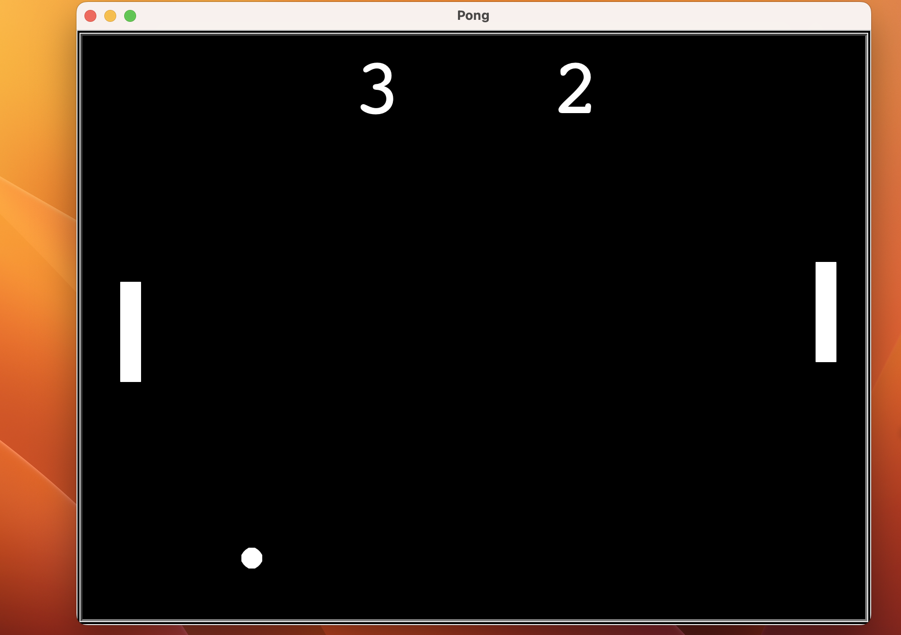

## Pong Game – Python Turtle Project

This is a Python implementation of the classic **Pong** game using the `turtle` graphics module.  
Two players can control paddles on either side of the screen to bounce the ball and score points!

---

##  Game Features

- Two-player control (W/S for left player, ↑/↓ for right player)
- Ball speeds up with each paddle hit
- Real-time score tracking
- Auto-reset when a player scores

---

##  Screenshot

