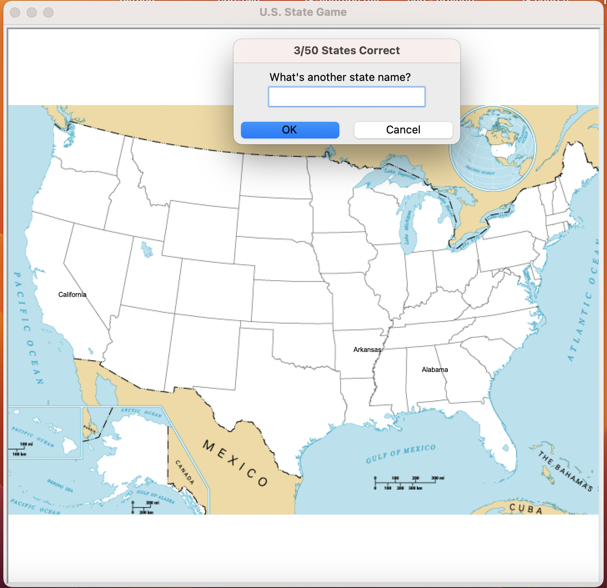

## U.S. States Guessing Game

A fun and interactive game built with Python's `turtle` graphics where you test your knowledge of U.S. states! As you guess each state correctly, it appears on a blank map.

---

## How to Play

- The game displays a blank map of the U.S.
- A prompt asks you to type a state's name.
- If your answer is correct, the state name will appear on the map.
- Type `"Exit"` anytime to quit the game.
- A file `states_to_learn.csv` will be created with states you missed.

---

## Screenshot

