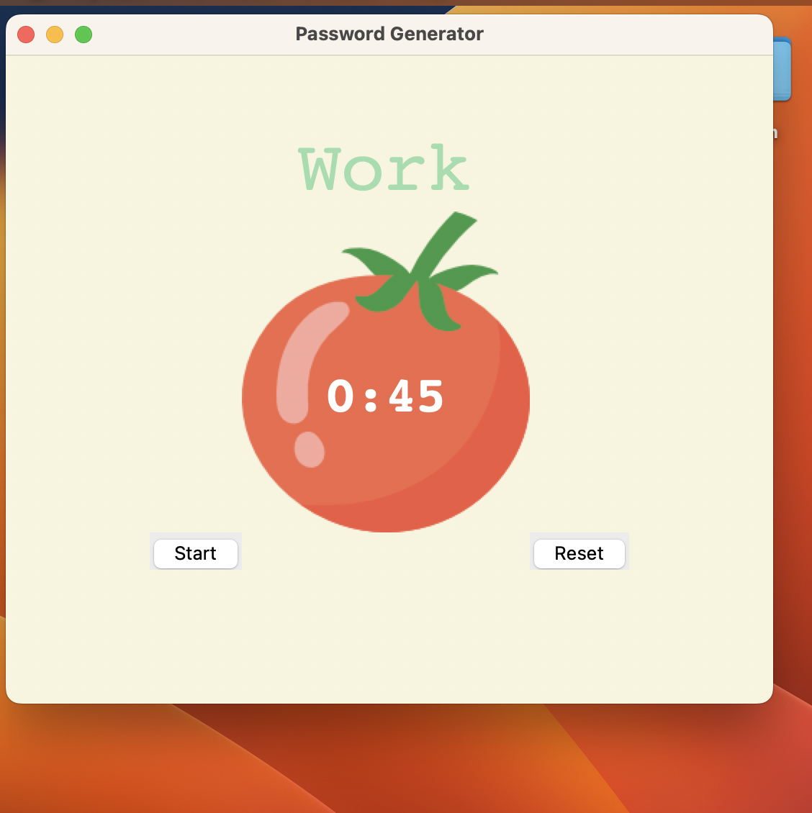

## Pomodoro Timer App

A simple and effective Pomodoro Timer built with Python's Tkinter library.  
This productivity tool is based on the Pomodoro Technique to help you focus and take breaks.

---

## What is the Pomodoro Technique?

- Work for 25 minutes (or any custom time)
- Take a short 5-minute break
- After four work sessions, take a longer 20-minute break
- Repeat the cycle to maximize productivity

---

## 🚀 Features

✅ Start/Reset buttons  
✅ Automatically switches between Work and Break sessions  
✅ Tracks completed work sessions with ✔ checkmarks  
✅ Simple, clean UI with a tomato graphic 🍅  
✅ Easily adjustable timer values (for testing or real usage)

---

## Screenshot  

