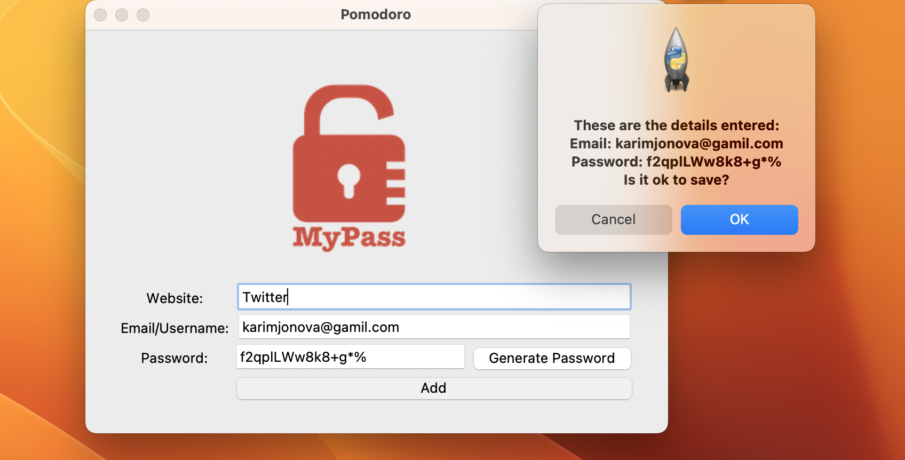

## Password Manager (Day 30 Project)

This is a simple **Password Manager** application built using Python and Tkinter. It allows you to:

- Generate strong, random passwords
- Save your website login credentials locally
- Copy passwords directly to your clipboard
- Store multiple entries in a text file (`data.txt`)

---

##  Features

- **Password Generator**: Creates secure passwords with letters, numbers, and symbols.
- **Clipboard Support**: Generated password is copied to the clipboard automatically.
- **Save Credentials**: Stores website, email, and password data into a local text file (`data.txt`).
- **Basic Input Validation**: Alerts if any field is left empty.
- **User Confirmation**: Confirms data before saving.

---

##  Screenshot

