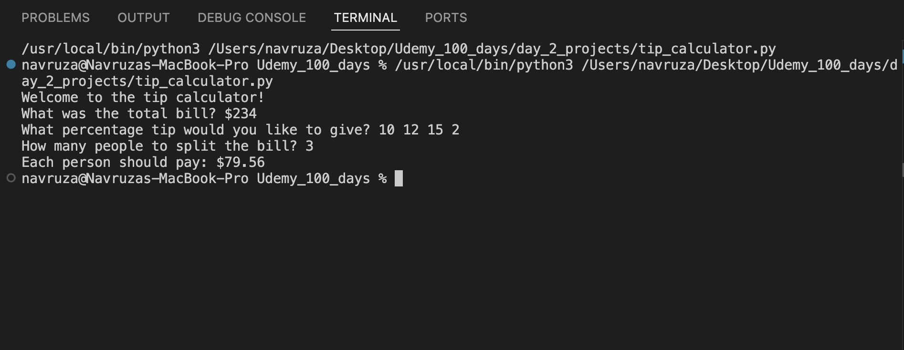

# Tip Calculator

A simple command-line Python app that helps you split a restaurant bill among friends, including the tip.

## Features

- Takes user input for:
- Total bill amount
- Tip percentage
- Number of people
- Calculates and displays how much each person should pay

## Screenshot

Here's how the tip calculator looks in action:

