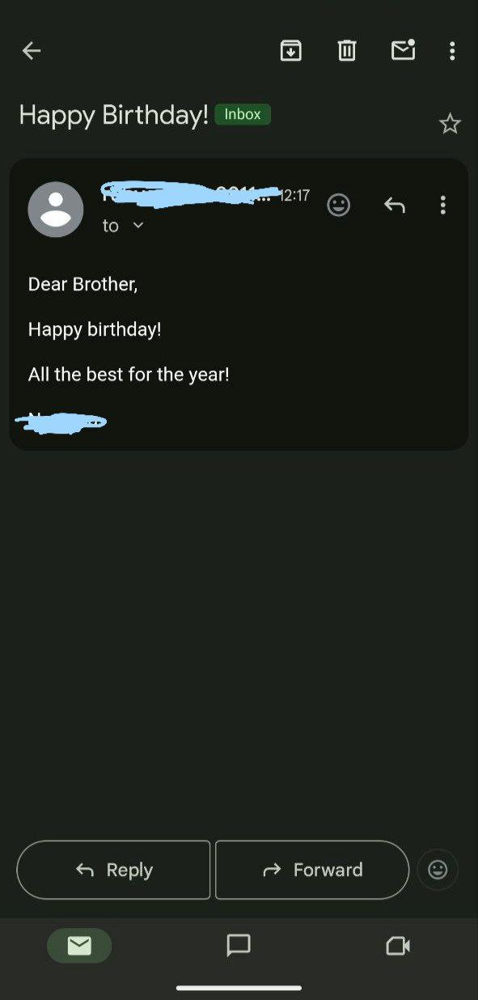

## Birthday Email Automation

This Python script automatically sends personalized birthday emails to your friends or family on their special day. It uses `pandas` to read data from a CSV, `datetime` to check the current date, and `smtplib` to send emails through your email provider.

---

## Features

- Sends a custom birthday message using randomly selected templates.
- Automatically detects birthdays matching today's date.
- Uses real email sending via SMTP (e.g., Gmail, Outlook, etc.).
- Easily customizable with your own templates and data.

---

## Screenshot

