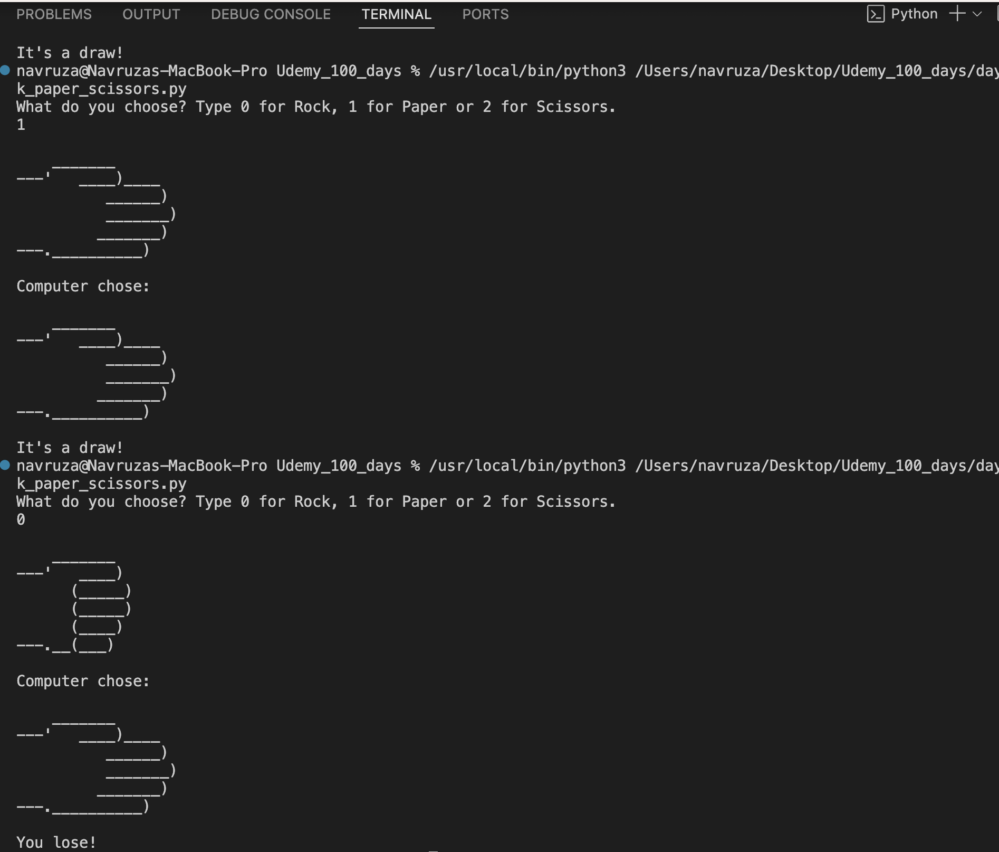

#✊🏻✋🏻✌🏻 Rock, Paper, Scissors – Python Game

A simple command-line version of Rock, Paper, Scissors where you play against the computer.

---

## 🎮 How to Play

1. Run the Python script in your terminal.
2. When prompted, type:
   - `0` for Rock  
   - `1` for Paper  
   - `2` for Scissors
3. The computer makes a random choice.
4. The winner is determined automatically.

---

## Screenshot

