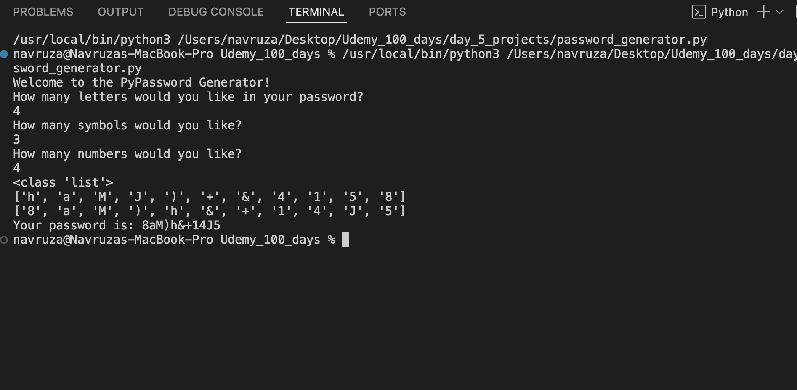

# Password Generator

A simple and customizable password generator written in Python. Choose how many letters, symbols, and numbers you'd like, and get a strong randomized password instantly!

---

## What It Does

- Takes user input for:
  - Number of letters
  - Number of symbols
  - Number of numbers
- Randomly generates characters from each group
- Mixs the result to enhance security
- Outputs a strong, randomized password

## Screenshot

