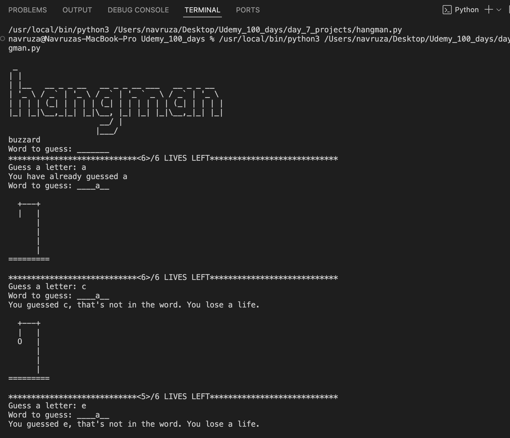

# Hangman Game – Python Project

Hangman game. The player must guess the hidden word one letter at a time while avoiding too many incorrect guesses. With each mistake, a visual hangman progresses toward defeat!

---

## 🧩 Game Description

This game:
- Selects a random word from a list.
- Displays underscores (`_`) for letters to be guessed.
- Takes user input to guess letters.
- Tracks correct and incorrect guesses.
- Uses ASCII art to show hangman stages.
- Ends when the word is guessed or all lives are lost.

---

## Screenshot

