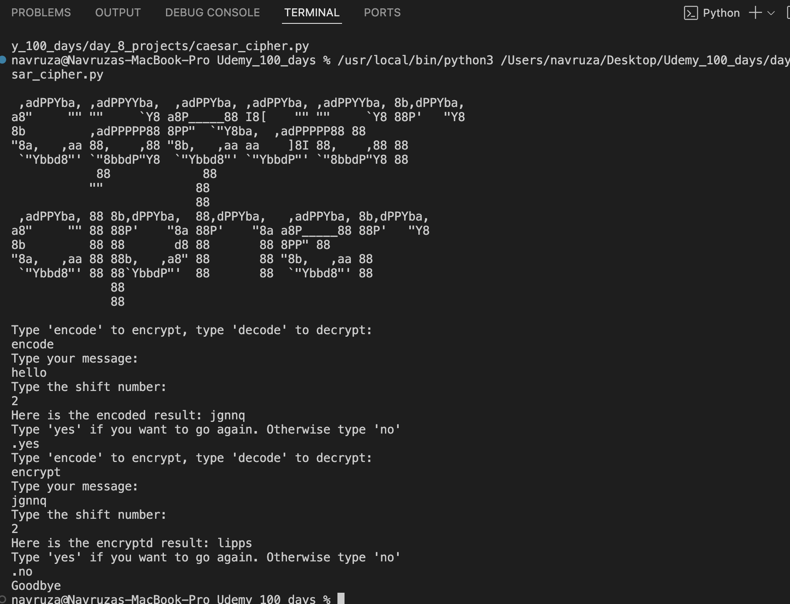

# Caesar Cipher – Python Project

A simple Caesar Cipher encryption and decryption tool built in Python. This program allows users to encode or decode messages by shifting letters in the alphabet.

---

## What Is Caesar Cipher? - Explanation

The Caesar Cipher is a basic encryption technique in which each letter in the plaintext is shifted a certain number of places down or up the alphabet.

---

## 🚀 Features

- Encode messages with a shift of any size
- Decode encrypted messages
- Automatically handles wrap-around of the alphabet
- Keeps non-letter characters (spaces, punctuation, numbers) unchanged
- Option to repeat the encryption/decryption without restarting the program
- ASCII art logo (imported from `art.py`)

---

## Screenshot
